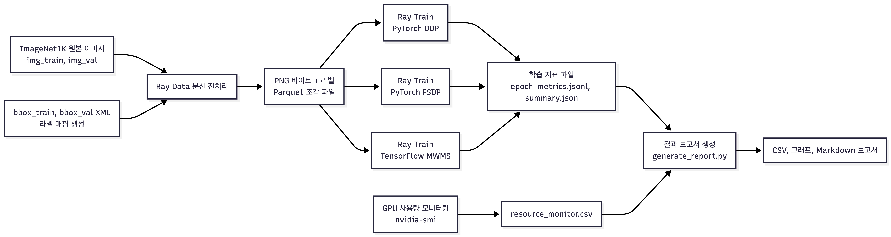
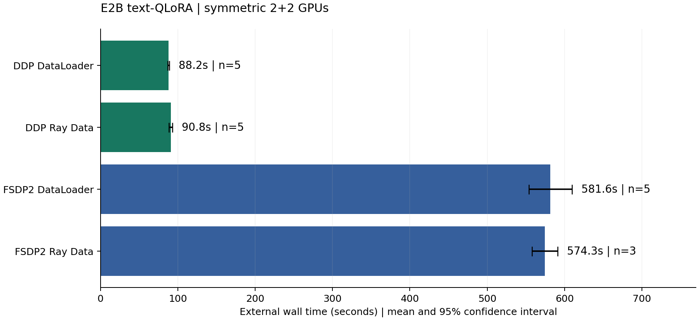

# DBLAB 데이터 파이프라인 연구 기록

DBLAB에서 진행한 데이터 준비와 분산 학습 실험을 시간순으로 기록했습니다. 2026년 4~5월에는 ImageNet 전처리와 학습 입력을 작업했고, 8~9월에는 KubeRay에서 언어모델 실험을 진행했습니다.

## ImageNet 데이터 준비

- 원본 이미지와 XML에서 라벨 정보를 읽어 매핑합니다.
- 이미지를 224×224로 변환하고 PNG 바이트로 인코딩합니다.
- 이미지 바이트, 정답 라벨, 원본 경로, WNID를 Parquet에 저장합니다.
- 전처리 결과를 Ray Train의 PyTorch·TensorFlow 실행에서 공통 입력으로 사용합니다.
- 연구 문서에 기록된 데이터 규모는 train 1,281,167장, validation 50,000장입니다.

실행 중에는 전처리 종료 집계 오류, Parquet shard별 행 수 차이, worker별 batch 수 불균형과 PNG 디코딩 비용을 확인했습니다. 이 문제를 겪은 뒤부터 산출 파일과 함께 행 수와 완료 상태를 검사했습니다.

## KubeRay 입력 제어와 관측

2026년 8~9월에는 로컬 캐시, Ray Train, Ray Data의 입력 경로를 따로 기록했습니다. 다중 노드 비교는 2+2 GPU 배치로 맞췄습니다. 선읽기 문제가 발생한 실행은 27.1k행, 3.5GiB를 읽었고 shard 내부에 제한을 적용한 뒤에는 12행, 약 61KiB를 읽었습니다.

NVML에서 GPU index 오류가 발생해 UUID로 장치를 찾도록 수정했습니다. 메모리는 PyTorch allocated, reserved와 NVML 사용량을 각각 기록했습니다.

## 반복 실험 분석

Gemma 4 E2B text-QLoRA를 대칭 2+2 GPU로 실행하고, 성공한 실행의 외부 wall-time을 집계했습니다. 2026-09-16에는 RUN_END 기록에서 아래 네 조건의 표본 수와 평균을 다시 계산해 기존 통계 CSV와 대조했습니다.

| 조건             | 관측 시간(초)           | 평균(초) |   n |
| ---------------- | ----------------------- | -------: | --: |
| DDP DataLoader   | 89, 87, 89, 88, 88      |    88.20 |   5 |
| DDP Ray Data     | 90, 94, 90, 89, 91      |    90.80 |   5 |
| FSDP2 DataLoader | 599, 573, 558, 567, 611 |   581.60 |   5 |
| FSDP2 Ray Data   | 567, 576, 580           |   574.33 |   3 |

신뢰구간은 Student t 분포로 계산한 평균의 95% CI입니다. 마지막 조건은 학습 결과 5회 가운데 외부 타이머 값이 남아 있는 3회만 사용했습니다.

원 보고서의 DataLoader 조건에서 PyTorch peak는 DDP 20.62GiB/GPU, FSDP2 15.81GiB/GPU였습니다. 평균 step은 각각 0.911초와 17.898초로, FSDP2의 메모리 사용량은 적었지만 실행 시간은 더 길었습니다.

[전체 통계 CSV](../assets/benchmark-statistics.csv) · [네 조건의 실행별 시간](../assets/benchmark-run-times.csv)

## 리뷰 임베딩

`vector.ipynb`에서 Polars로 리뷰를 정제하고 Ko-SBERT로 인코딩한 뒤 Parquet로 저장했습니다. 저장된 출력에는 리뷰 199,992개의 768차원 임베딩이 있습니다. Faiss Flat, IVFFlat, IVFPQ, HNSW를 비교했으며 단일 질의의 Flat 첫 결과 유사도는 0.8729였습니다. 다음 실험 항목은 반복 질의와 Recall@k 측정입니다.

## 자료 계보

| 범위      | 원본 프로젝트 내 자료                                                                                |
| --------- | ---------------------------------------------------------------------------------------------------- |
| ImageNet  | ray_imagenet_bench/docs/presentation_pipeline.md, preprocess_imagenet.py, 2026-04-28 파이프라인 PNG  |
| KubeRay   | kuberay-benchmark/RESULTS_SUMMARY.md, run_ray_train.py, common.py                                    |
| 반복 분석 | results/paper-statistics/training_wall_time_statistics.csv, STATISTICAL_REPORT.md, 성공 RUN_END 로그 |
| 리뷰      | DBLAB/study/vector_db_report/data/vector.ipynb의 셀 인덱스 5·17 저장 출력                            |

모든 실험은 DBLAB 공동 연구 환경에서 진행했습니다. 위 표에는 포트폴리오에 사용한 코드, 문서와 로그의 위치를 적었습니다.
